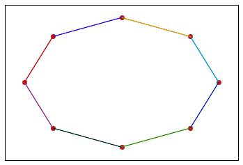
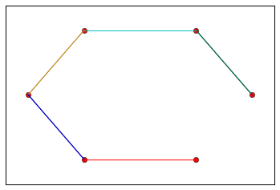
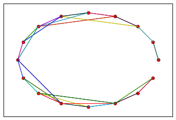
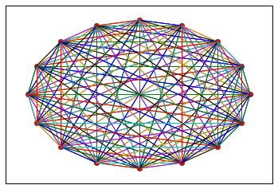
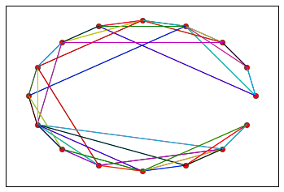
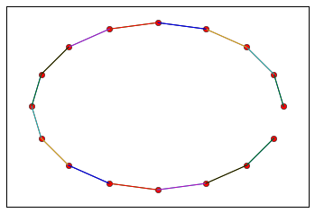
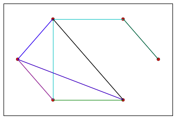
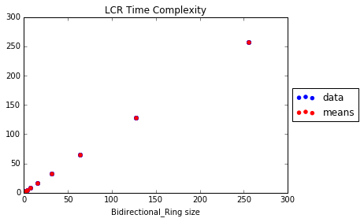
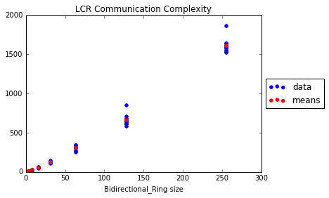
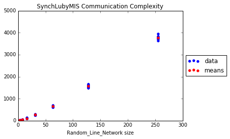

# README

DATK is a Distributed Algorithms Toolkit for Python


## Documentation

Visit [amin10.github.com/datk](http://amin10.github.io/datk/) for documentation


## Testing

Run tests by executing the following command in the repo directory

    $ python -m datk.tests.tests

    $ python -m datk.tests.networks_tests


## Usage

### Networks

#### Ring Network


```python
>>> x = Bidirectional_Ring(8)
>>> x.draw()
```



```python
>>> x.state()
```

<pre>
[('P4', {'n': 8}),
 ('P1', {'n': 8}),
 ('P2', {'n': 8}),
 ('P5', {'n': 8}),
 ('P0', {'n': 8}),
 ('P7', {'n': 8}),
 ('P6', {'n': 8}),
 ('P3', {'n': 8})]
</pre>

#### Line Network

```python
>>> Bidirectional_Line(6).draw()
```




#### Random Line Network

```python
>>> Random_Line_Network(16).draw()
```



```python
>>> Random_Line_Network(16, sparsity=0).draw()
```



```python
>>> Random_Line_Network(16, sparsity=0.5).draw()
```



```python
>>> Random_Line_Network(16, sparsity=float('inf')).draw()
```




### Algorithms

#### A Basic Algorithm: LCR

```python
>>> x = Unidirectional_Ring(5)
```

##### Initial Network State

```python
>>> x.state()
```

    [('P2', {'n': 5}),
     ('P4', {'n': 5}),
     ('P1', {'n': 5}),
     ('P0', {'n': 5}),
     ('P3', {'n': 5})]

<!-- -->

```python
>>> lcr = LCR(x)
```

    --------------
    Running LCR on
    [P2 -> {P4}, P4 -> {P1}, P1 -> {P0}, P0 -> {P3}, P3 -> {P2}]
    Round 1
    P2.status is non-leader
    P1.status is non-leader
    P0.status is non-leader
    Round 2
    P0.status is non-leader
    Round 3
    P3.status is non-leader
    Round 4
    P2.status is non-leader
    Round 5
    P4.status is leader
    Algorithm Terminated
    Message Complexity: 11
    ----------------------


##### Time Complexity

```python
>>> print lcr.r, "rounds"
```

    5 rounds


##### Message Complexity

```python
>>> print lcr.message_count, "messages"
```

    11 messages


##### Final Network State

```python
>>> x.state()
```


    [('P2', {'n': 5, 'status': 'non-leader'}),
     ('P4', {'n': 5, 'status': 'leader'}),
     ('P1', {'n': 5, 'status': 'non-leader'}),
     ('P0', {'n': 5, 'status': 'non-leader'}),
     ('P3', {'n': 5, 'status': 'non-leader'})]


#### Chaining Algorithms

```python
>>> x = Random_Line_Network(6)
```

<!-- -->

```python
# Elect a Leader
>>> FloodMax(x, params={'verbosity': Algorithm.QUIET})
```

    FloodMax Terminated
    Message Complexity: 80
    Time Complexity: 6
    ------------------

<!-- -->

```python
# Construct a BFS tree rooted at the Leader 
>>> SynchBFS(x)
```

    -------------------
    Running SynchBFS on
    [P3 -> {P4}, P4 -> {P3, P1}, P1 -> {P4, P0, P2, P5}, P0 -> {P1, P2, P5}, P2 -> {P1, P0, P5}, P5 -> {P1, P0, P2}]
    Round 1
    P5.parent is None
    P1.parent is P5
    P0.parent is P5
    P2.parent is P5
    Round 2
    P4.parent is P1
    Round 3
    P3.parent is P4
    Round 4
    SynchBFS Terminated
    Message Complexity: 16
    Time Complexity: 4
    ------------------

<!-- -->

```python
>>> SynchConvergeHeight(x, params={'draw':True})
```

    --------------------------
    Running _ConvergeHeight on





    [P3 -> {P4}, P4 -> {P3, P1}, P1 -> {P4, P0, P2, P5}, P0 -> {P1, P2, P5}, P2 -> {P1, P0, P5}, P5 -> {P1, P0, P2}]
    Round 1
    Round 2
    Round 3
    Round 4
    P5.height is 3
    _ConvergeHeight Terminated
    Message Complexity: 8
    Time Complexity: 4
    ------------------

<!-- -->

```python
>>> x.state()
```

    [('P3', {'n': 6, 'parent': P4 -> {P3, P1}, 'status': 'non-leader'}),
     ('P4', {'n': 6, 'parent': P1 -> {P4, P0, P2, P5}, 'status': 'non-leader'}),
     ('P1', {'n': 6, 'parent': P5 -> {P1, P0, P2}, 'status': 'non-leader'}),
     ('P0', {'n': 6, 'parent': P5 -> {P1, P0, P2}, 'status': 'non-leader'}),
     ('P2', {'n': 6, 'parent': P5 -> {P1, P0, P2}, 'status': 'non-leader'}),
     ('P5', {'height': 3, 'n': 6, 'parent': None, 'status': 'leader'})]


#### Equivalently, chain them like this:

```python
>>> x = Random_Line_Network(6)
>>> A = Chain(FloodMax(), Chain(SynchBFS(), SynchConvergeHeight()), params={'verbosity':Algorithm.QUIET})
>>> A(x)
```

    FloodMax Terminated
    Message Complexity: 50
    Time Complexity: 6
    ------------------
    SynchBFS Terminated
    Message Complexity: 10
    Time Complexity: 5
    ------------------
    _ConvergeHeight Terminated
    Message Complexity: 11
    Time Complexity: 5
    ------------------

<!-- -->

```python
>>> x.state()
```

    [('P1', {'n': 6, 'parent': P5 -> {P1, P3}, 'status': 'non-leader'}),
     ('P5', {'height': 4, 'n': 6, 'parent': None, 'status': 'leader'}),
     ('P3', {'n': 6, 'parent': P5 -> {P1, P3}, 'status': 'non-leader'}),
     ('P4', {'n': 6, 'parent': P3 -> {P5, P4}, 'status': 'non-leader'}),
     ('P0', {'n': 6, 'parent': P4 -> {P3, P0}, 'status': 'non-leader'}),
     ('P2', {'n': 6, 'parent': P0 -> {P4, P2}, 'status': 'non-leader'})]


### Benchmarking Algorithms

```python
>>> benchmark(LCR, Bidirectional_Ring, testLeaderElection)
```

    Sampling n = 2, 4, 8, 16, 32, 64, 128, 256...  DONE








```python
>>> benchmark(SynchLubyMIS, Random_Line_Network, testLubyMIS)
```

    Sampling n = 2, 4, 8, 16, 32, 64, 128, 256...  DONE





## Made with love by:

Amin Manna ([amin10][amin_gh], [manna@mit.edu][amin_email])

Mayuri Sridhar ([mayuri95][mayuri_gh], [mayuri@mit.edu][mayuri_email])

[amin_email]:mailto:manna@mit.edu
[amin_gh]:http://github.com/amin10
[mayuri_email]:mailto:mayuri@mit.edu
[mayuri_gh]:http://github.com/mayuri95